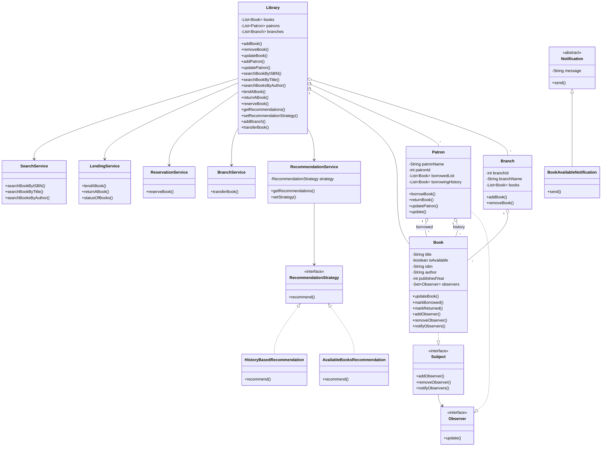

git # Library Management System

A Java-based Library Management System designed for librarians to manage books, patrons, lending, reservations, recommendations, inventory, and multiple library branches.

The project demonstrates object-oriented programming, SOLID principles, Java Collections, logging, and software design patterns.

## Features

### Core Features

* Add, remove, and update books
* Search books by:

  * ISBN
  * Title
  * Author
* Add and update patrons
* Prevent duplicate book ISBNs
* Prevent duplicate patron IDs
* Checkout books
* Return books
* Prevent borrowing an already borrowed book
* Maintain patron borrowing history
* Display available and borrowed books

### Optional Features

#### Multi-Branch Support

* Create multiple library branches
* Maintain books at different branches
* Transfer books between branches
* Prevent transfer of borrowed books

#### Book Reservations

* Patrons can reserve books that are currently borrowed
* Duplicate reservations are prevented
* Patrons are notified when a reserved book is returned

#### Book Recommendations

Two recommendation strategies are implemented:

* History-based recommendations
* Available-books recommendations

The recommendation strategy can be changed at runtime.

---

## Project Structure

```text
src
└── com.airtribe.library
    ├── LibraryApp.java
    │
    ├── entity
    │   ├── Book.java
    │   ├── Patron.java
    │   ├── Library.java
    │   ├── Branch.java
    │   ├── Notification.java
    │   └── BookAvailableNotification.java
    │
    └── service
        ├── Subject.java
        ├── Observer.java
        ├── SearchService.java
        ├── LendingService.java
        ├── ReservationService.java
        ├── BranchService.java
        ├── RecommendationStrategy.java
        ├── RecommendationService.java
        ├── HistoryBasedRecommendation.java
        └── AvailableBooksRecommendation.java
```

---

## Object-Oriented Programming

### Encapsulation

Class fields are kept private and accessed through public methods.

For example, `Book` controls its availability through:

* `markBorrowed()`
* `markReturned()`

Instead of allowing other classes to directly modify the availability field.

Patron borrowing lists are also protected by returning copies rather than exposing the internal lists directly.

### Inheritance

The notification system uses inheritance:

```text
Notification
      ↑
BookAvailableNotification
```

`Notification` is an abstract class and `BookAvailableNotification` provides the concrete implementation of `send()`.

### Polymorphism

The notification system uses a `Notification` reference that can refer to a `BookAvailableNotification` object.

The recommendation system also uses polymorphism through the `RecommendationStrategy` interface.

### Abstraction

Interfaces and abstract classes hide implementation details.

Examples:

* `Observer`
* `Subject`
* `RecommendationStrategy`
* `Notification`

---

## SOLID Principles

### Single Responsibility Principle

Different responsibilities are separated into different classes.

Examples:

* `SearchService` handles book searching
* `LendingService` handles borrowing and returning
* `ReservationService` handles reservations
* `BranchService` handles branch transfers
* `RecommendationService` handles recommendation selection

### Open/Closed Principle

The recommendation system is designed so new recommendation algorithms can be added without modifying the existing recommendation service.

For example:

```text
RecommendationStrategy
        ├── HistoryBasedRecommendation
        └── AvailableBooksRecommendation
```

A new strategy can implement `RecommendationStrategy`.

### Liskov Substitution Principle

`BookAvailableNotification` can be used wherever a `Notification` is expected because it follows the contract defined by the abstract `Notification` class.

### Interface Segregation Principle

Small, focused interfaces are used instead of one large interface.

Examples:

* `Observer`
* `Subject`
* `RecommendationStrategy`

### Dependency Inversion Principle

The recommendation service works with the `RecommendationStrategy` abstraction rather than depending on a specific recommendation algorithm.

The strategy is also supplied to `RecommendationService`, allowing the implementation to be changed at runtime.

---

## Design Patterns

### 1. Observer Pattern

The Observer pattern is used for book reservations.

When a patron reserves a borrowed book:

```text
Book
  │
  └── maintains observers
          │
          └── Patron
```

When the book is returned, the book notifies its observers.

The patron then creates a `BookAvailableNotification`.

Classes involved:

* `Subject`
* `Observer`
* `Book`
* `Patron`
* `Notification`
* `BookAvailableNotification`

A `Set` is used to store observers so the same patron cannot be registered more than once.

### 2. Strategy Pattern

The Strategy pattern is used for book recommendations.

```text
RecommendationService
          │
          ▼
RecommendationStrategy
       /        \
      /          \
HistoryBased   AvailableBooks
Recommendation Recommendation
```

The strategy can be changed at runtime using:

```java
library.setRecommendationStrategy(
    new AvailableBooksRecommendation()
);
```

This allows different recommendation algorithms to be used without changing the main recommendation service.

---

## Java Collections Used

The project uses Java Collections in meaningful places.

### List

`List<Book>` is used for:

* Library books
* Patron borrowed books
* Patron borrowing history
* Branch books
* Search results

### Set

`Set<Observer>` is used by `Book` to store reservation observers.

A `Set` prevents duplicate observers.

### Map

`Map<String, List<Book>>` is used by the inventory system to group books into:

* Available
* Borrowed Books

---

## Logging

Java's built-in `java.util.logging` framework is used for application logging.

Logging is included for important operations such as:

* Adding books
* Updating books
* Adding patrons
* Borrowing books
* Returning books
* Reservations
* Branch transfers
* Invalid operations

Example:

```text
INFO: Book borrowed: Clean Code - Updated by patron Sai Updated
WARNING: Book already borrowed: Clean Code - Updated
```

---

## Class Diagram



---

## How to Run

### Requirements

* Java JDK 21 or later
* IntelliJ IDEA or another Java IDE

### Run using IntelliJ IDEA

1. Clone the repository.
2. Open the project in IntelliJ IDEA.
3. Configure JDK 21.
4. Mark `src` as the Sources Root if required.
5. Run:

```text
com.airtribe.library.LibraryApp
```

The application demonstrates the implemented features through console output.

---

## Example Output

```text
=== BOOK MANAGEMENT ===
Add Clean Code: true
Add Clean Architecture: true
Add Design Patterns: true
Add duplicate ISBN: false

=== PATRON MANAGEMENT ===
Add Sai: true
Add Rahul: true
Add duplicate patron ID: false

=== LENDING ===
Lend Clean Code: true
Book available: false
Borrowed books: 1
Lend same book again: false

=== RESERVATION / OBSERVER ===
Rahul reserves Clean Code: true
Rahul reserves again: false

=== RETURN ===
NOTIFICATION: Notification for Rahul: Book "Clean Code - Updated" is now available.

=== HISTORY BASED RECOMMENDATION ===
[Clean Architecture]

=== CHANGE STRATEGY ===
[Clean Code - Updated, Clean Architecture, Design Patterns]

=== MULTI-BRANCH ===
Transfer Design Patterns: true

=== TEST COMPLETED ===
```

---

## Assumptions

* The system is an in-memory application.
* No database or external persistence is required.
* ISBN uniquely identifies a book.
* Patron ID uniquely identifies a patron.
* A borrowed book cannot be transferred between branches.
* Reservations are allowed only for currently borrowed books.
* A patron cannot reserve the same book more than once.
* Recommendations are generated using the selected recommendation strategy.

---

## Technologies

* Java 21
* Object-Oriented Programming
* Java Collections Framework
* `java.util.logging`
* IntelliJ IDEA
* Git & GitHub

---

## Repository

This project is available as a public GitHub repository:

`https://github.com/Kandanuru-venkata-sai/Library-management-system`
